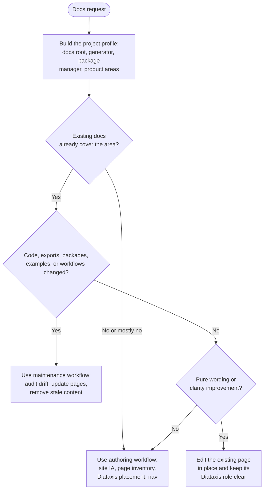

# Documentation Skill

Use this skill as the operating manual for documentation work on any repository.
The site describes the repository as it exists today, and nothing else.

This skill is generator-agnostic.
It works with Vocs, Docusaurus, Nextra, Starlight, VitePress, Mintlify, or a plain Markdown tree.
Discover which one the repo uses before doing anything else.

## Routing

| Task | Read |
|------|------|
| Establish repo truth, docs layout, and validation commands | `reference/source-of-truth.md` |
| Create or heavily restructure docs | `reference/authoring.md` |
| Update docs after code, package, API, or example changes | `reference/maintenance.md` |
| Prose and structure quality | `reference/best-practices.md` |
| Document a component library | `reference/mdx-component-docs.md` |
| Set up a Vocs site from scratch | `reference/vocs-docs-site.md` |
| Write or refresh a README | `reference/templates.md` |

Read `reference/source-of-truth.md` first for every task.
Then load only the focused workflow reference you need.
Load `reference/best-practices.md` after the repo-truth and workflow references, not before.

## Decision Tree



## Required Working Order

1. Read `reference/source-of-truth.md` and build the project profile for this repo.
2. Read the current docs pages and the current public code surfaces before drafting.
3. Classify or re-classify each touched page by Diataxis:
   - Tutorial
   - How-to guide
   - Explanation
   - Reference
4. Update the navigation config if the information architecture or page inventory changed.
5. Write docs as a present-state snapshot of the current repo.
6. Validate with the repo's real docs workflow.

## Non-Negotiable Rules

- Use repository truth over memory.
- Treat docs as a snapshot of the current state.
- Do not narrate past architecture or older names unless the current code explicitly exposes a deprecated or compatibility surface.
- Keep navigation and page structure aligned.
- Stay within the navigation primitives the current site config already uses, unless the generator clearly supports a different structure.
- Document examples from the repo's real example inventory and the actual example code, not from guesswork.
- Read only the code surfaces relevant to the docs area being changed.
  Do not bulk-load the entire repo unless the task genuinely requires a site-wide audit.
- Use the repo's own package manager and scripts.
  Never assume npm, pnpm, yarn, or bun without checking.
- Prefer rewriting or deleting stale content over appending historical disclaimers.

## Scope Boundaries

This skill covers end-user and maintainer-facing documentation that lives in the repo's docs site:

- getting started and installation
- core concepts and mental models
- per-package or per-module usage
- task-oriented how-to guides
- API reference
- examples documentation
- any CLI, tooling, or benchmarking pages the site exposes

Use `reference/templates.md` for README work.
Use `reference/mdx-component-docs.md` for component library documentation.

## Validation

Discover the real commands from the docs app's `package.json` rather than assuming them.
The usual shape is a typecheck followed by a build, run with the repo's package manager:

```bash
cd <docs-root>
<pkg-manager> run typecheck
<pkg-manager> run build
```

If the site is Vocs-based, also run the bundled structural validator:

```bash
<runtime> <skill-dir>/assets/validate-docs.ts <docs-root>
```

Respect any documented build exception in the docs app README exactly.
If the repo wraps its build in a script for a reason, do not replace that wrapper with a direct generator invocation.

## References

- [Source of Truth](reference/source-of-truth.md) - Build the project profile before any docs work
- [Authoring](reference/authoring.md) - Create or restructure a docs site
- [Maintenance](reference/maintenance.md) - Fix docs drift after code changes
- [Best Practices](reference/best-practices.md) - Prose and structure standards
- [MDX Component Docs](reference/mdx-component-docs.md) - Component documentation standard
- [Vocs Docs Site](reference/vocs-docs-site.md) - Vocs and Storybook setup guide
- [Templates](reference/templates.md) - README templates by project type

## Assets

- `assets/validate-docs.ts` - Structural validation for a Vocs docs site
